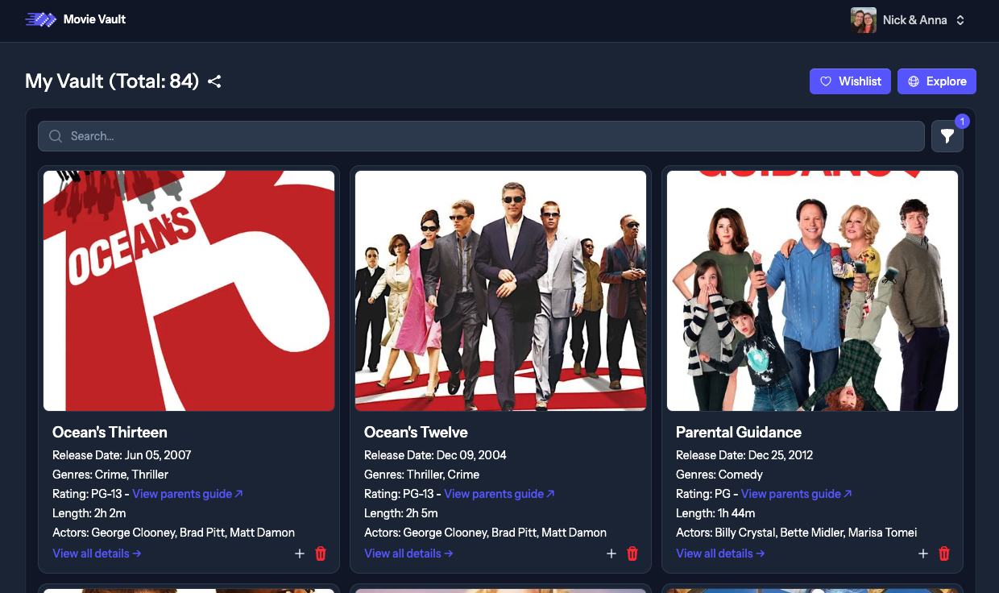

# Movie Vault

A fun and easy way to track your movie and TV show collection! Add titles to your personal vault (what you own) and keep a wishlist for future additions.



## Features

Explore Movies & TV Shows: Discover new favorites.

Vault: Keep track of what you own.

Wishlist: Save movies and shows you want to watch or buy.

## Installation

After cloning this repo, run the following commands from your project root:

```
cp .env.example .env
composer install
php artisan key:generate
touch database/database.sqlite
php artisan migrate --seed
php artisan flux:activate
npm install
npm run dev
```

Create an account and API key on [TMDB.com](https://developer.themoviedb.org/docs/getting-started).

Add your TMDB API key to your .env file:

`MOVIE_API_TOKEN=your_tmdb_api_key`

Now, open the project in your browser (Typically http://movie-vault.test) and use the following credentials to log in:

```
Email: admin@example.com
Password: password
```

## Testing

Run tests with:

`php artisan test`

